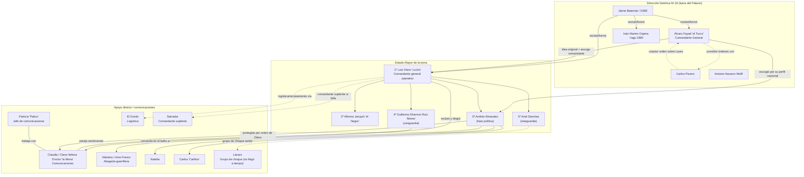
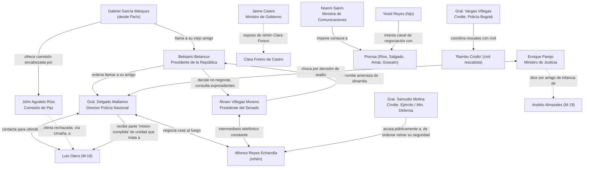
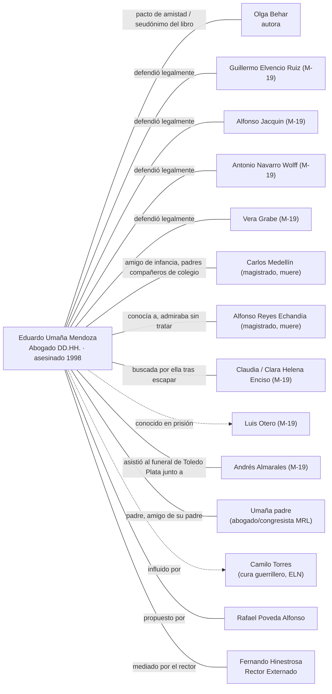

# Noches de Humo — Diagramas de Relaciones

Estos diagramas usan sintaxis **Mermaid**. Puedes verlos renderizados en:
- VS Code (extensión "Markdown Preview Mermaid Support"), o
- pegando cada bloque en https://mermaid.live

Para mantenerlos legibles, se dividieron en 4 vistas en lugar de un único mega-diagrama con 150+ personajes (ver `personajes-noches-de-humo.md` para la lista completa).

---

## Diagrama 1 — Mando del M-19 en la toma del Palacio

---

## Diagrama 2 — Rama judicial: quién murió, quién sobrevivió, lazos familiares

```mermaid
graph TD
    subgraph CORTE["Corte Suprema de Justicia — Sala Penal"]
        REYES["Alfonso Reyes Echandía<br/>Presidente de la Corte · MUERE"]
        GAONA["Manuel Gaona Cruz · MUERE<br/>(versión disputada)"]
        MEDINA["Ricardo Medina Moyano · MUERE"]
        MEDELLIN["Carlos Medellín · MUERE"]
        SERRANO["Pedro Elías Serrano · MUERE"]
        CALDERON["Fabio Calderón Botero · MUERE"]
        VELASQUEZ["Darío Velásquez Gaviria · MUERE"]
        GNECCO["José Gnecco · MUERE"]
        TAPIAS["Hernando Tapias Rocha · SOBREVIVE"]
        CAMACHO["Nemesio Camacho · SOBREVIVE"]
        ARCINIEGAS["Reinaldo Arciniegas · SOBREVIVE"]
        MURCIA["Humberto Murcia Ballén · SOBREVIVE"]
    end

    subgraph FAMILIA["Familia Reyes Echandía"]
        SIRENIA["Sirenia (esposa)"]
        YESID["Yesid Reyes (hijo)<br/>Negocia por teléfono toda la crisis"]
        EMIRO["Emiro (hijo)"]
        HIJOA["Alfonso hijo"]
        HIJAS["Sirenia (hija)"]
    end

    REYES --- SIRENIA
    REYES --- YESID
    REYES --- EMIRO
    REYES --- HIJOA
    REYES --- HIJAS

    REYES -->|murió junto a, en oficina de Serrano| SERRANO
    SERRANO --- MEDINA
    SERRANO --- CALDERON
    SERRANO --- VELASQUEZ
    SERRANO --- GNECCO

    MEDELLIN ---|amigo de toda la vida| UMANA["Eduardo Umaña Mendoza<br/>(abogado DD.HH.)"]
    GAONA -->|lideró negociación de rehenes| TAPIAS
    GAONA --- CAMACHO
    ARCINIEGAS -->|su descripción delató a| CARLITOS2["'Carlitos' (M-19)<br/>capturado/desaparecido"]
    MURCIA ---|reencuentro| ARCINIEGAS

    REYES ===|amistad de toda la vida desde 1953| DELGADO["Gral. Víctor A. Delgado Mallarino<br/>Director Policía Nacional"]
```

---

## Diagrama 3 — Cadena de decisión Gobierno/Militar durante la crisis

---

## Diagrama 4 — La red de Eduardo Umaña (el hilo que conecta todos los bandos)

Este personaje es clave porque el libro lo usa para **tejer** a los tres bandos (M-19, judicial, gobierno) a través de sus relaciones personales.

---

### Cómo leer estos diagramas
- `-->` o `--` = relación/interacción directa mencionada en el texto.
- `-.->` = relación indirecta, rumor, o mención de segunda mano.
- `<-->` = comunicación en ambos sentidos (ej. llamadas telefónicas).
- `===` = relación de **amistad personal de larga data** (el eje emocional de buena parte del libro).

Para el elenco completo (150+ nombres, incluyendo combatientes rasos, periodistas, familiares y rehenes del Consejo de Estado), consulta `personajes-noches-de-humo.md`.
